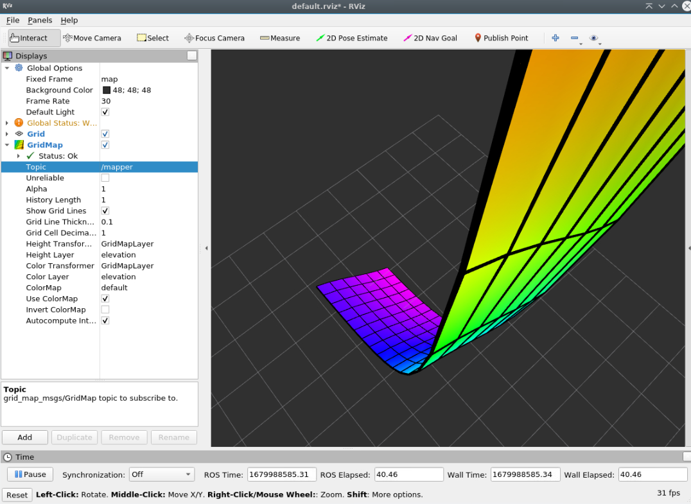

# grid_map_simpletest
Familiarizing with grid_map APIs

This is a minimal package to test some of the `grid_map` package APIs.

### Author(s)

* **Siddharth Saha** - [trunc8](https://github.com/trunc8)

Created with :heart: by <a href="https://www.linkedin.com/in/sahasiddharth611/">Siddharth</a>
